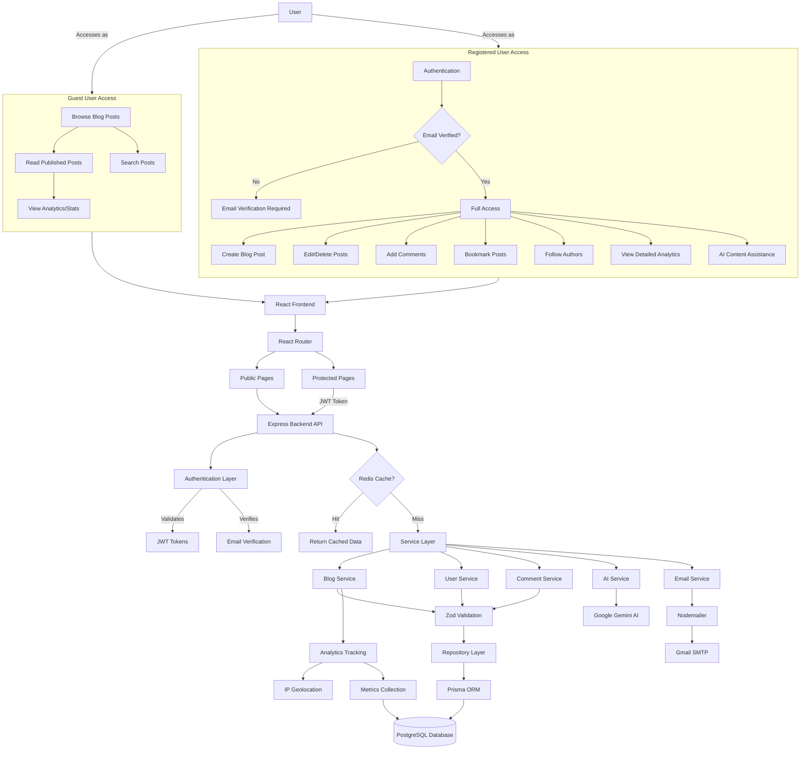

# Bloguer


<!-- <p align="center">
  <a href="https://hits.sh/github.com/pulkitgarg04/bloguer/">
    
  </a>
</p> -->

**Bloguer** is a modern blogging platform designed to provide a seamless experience for creating, managing, and sharing blog content. Built with the latest technologies, Bloguer emphasizes speed, scalability, and a developer-friendly ecosystem.

The platform supports rich text formatting, image uploads, user authentication, and dynamic content delivery, ensuring a superior blogging experience.

### System Architecture:


**[View System Architecture & Flow Diagrams](SYSTEM_OVERVIEW.md)**

### Setup and Installation
#### Pre-Requisites
- Node.js (v16 or above)
- PostgreSQL Database
- npm or bun or yarn for package management

#### Installation
1. Clone the repository:
```bash
git clone https://github.com/pulkitgarg04/bloguer.git  
cd bloguer  
```

2. Install dependencies for both the client and server:

```bash
# Navigate to server and install
cd server
npm install

# Navigate to client and install
cd ../client
npm install
```

3. Set up Environment Variables for required variables and setup.

4. Run the server:
```bash
# In server shell
npm run dev
```

5. Run the frontend locally:
```bash
# In client shell
npm run dev  
```

### Environment Variables

The project relies on several environment variables. Create a `.env` file in both the client and server directories based on the provided examples:

- **Server**: See [server/.env.example](server/.env.example) for required backend configuration
- **Client**: See [client/.env.example](client/.env.example) for required frontend configuration

#### Key Environment Variables:

**Server (.env):**
- `DATABASE_URL` - PostgreSQL connection string
- `JWT_SECRET` - Secret key for JWT token generation
- `SMTP_HOST`, `SMTP_PORT`, `SMTP_USER`, `SMTP_PASS` - Email configuration for Nodemailer
- `GOOGLE_CLIENT_ID`, `GOOGLE_CLIENT_SECRET` - Google OAuth credentials
- `GEMINI_API_KEY` - Google Gemini AI API key
- `REDIS_URL` - Redis connection string for caching
- `PORT` - Server port (default: 4000)

**Client (.env):**
- `VITE_BACKEND_URL` - Backend API URL
- `VITE_GOOGLE_CLIENT_ID` - Google OAuth Client ID

**Note**: To use the AI-powered article writing feature, you'll need to:
- Get a Google Gemini API key from [Google AI Studio](https://makersuite.google.com/app/apikey)


### Features
- **Blog Management**: Create, edit, and delete blog posts.
- **AI-Powered Writing**: Generate article content using Generative AI based on title and category.
- **User Authentication**: Secure login and signup with JWT.
- **Rich Text Editor**: Enables dynamic content creation.
- **Serverless Architecture**: Ensures speed and scalability with Cloudflare Workers.

### Changelog
Refer to [CHANGELOG](CHANGELOG.md) for version history and updates.

### Contributing
We appreciate your interest in contributing to Bloguer! Your contributions help us improve and grow. Please feel free to submit pull requests, report issues, or suggest new features. Your feedback and participation are highly valued as we continue to develop and enhance the platform.

For detailed guidelines on how to contribute, please see our [CONTRIBUTING](CONTRIBUTING.md) file.

### License
This project is licensed under the MIT License - see the [LICENSE](LICENSE) file for details.