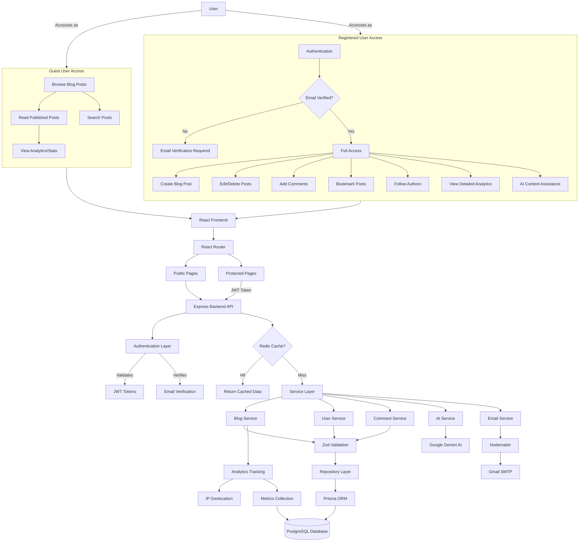
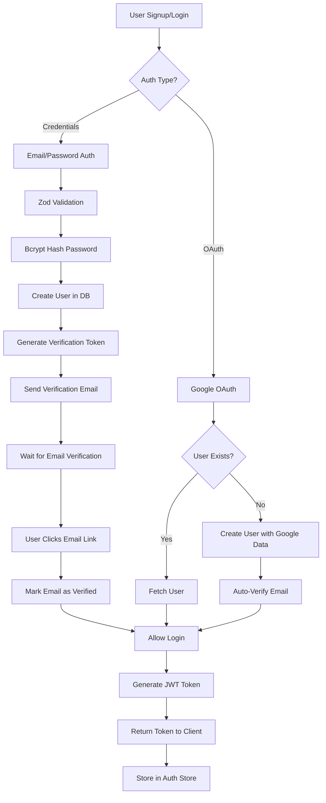
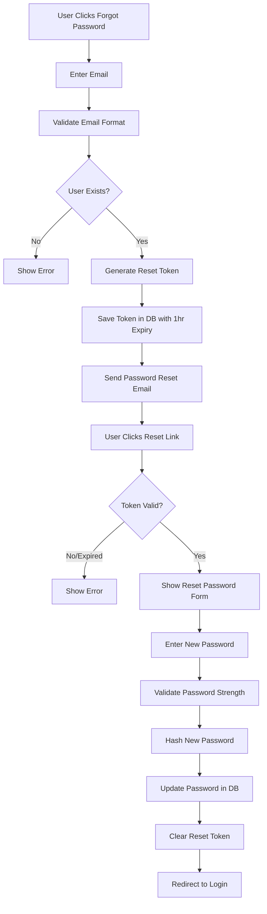
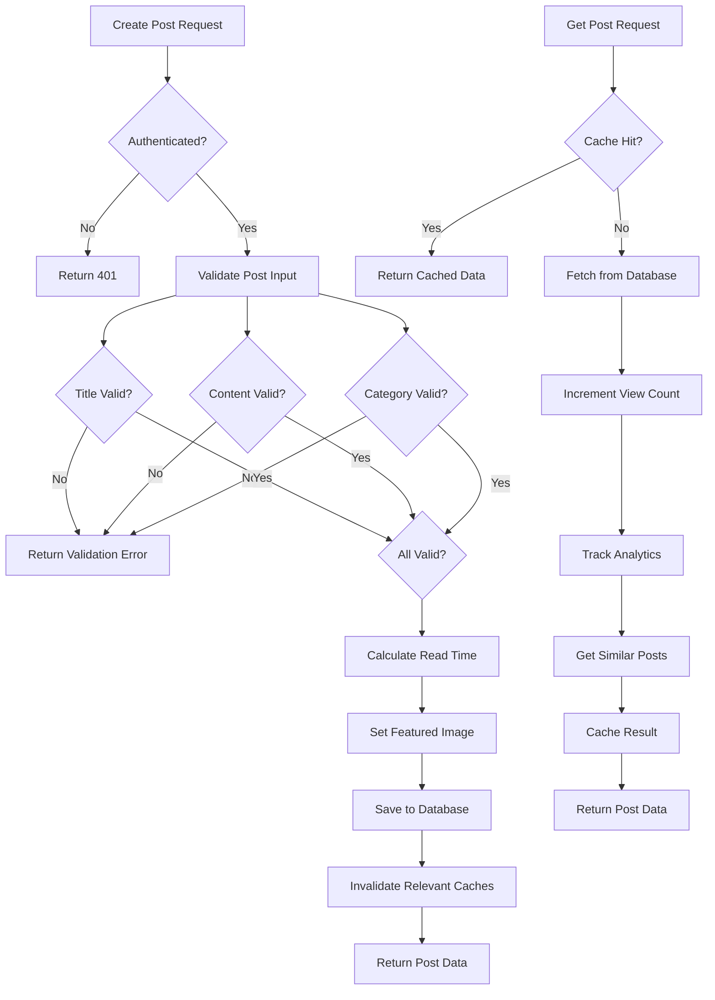
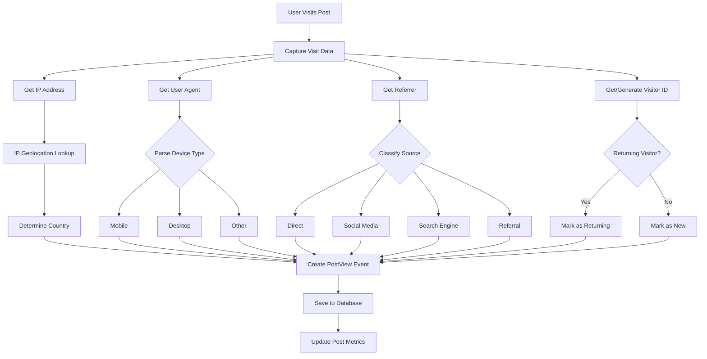
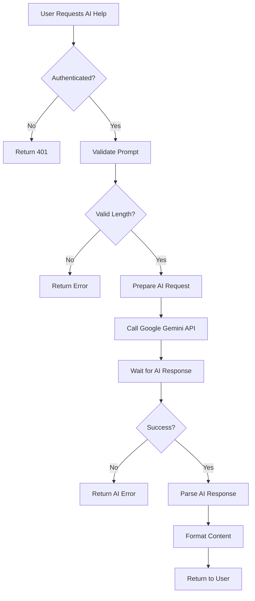
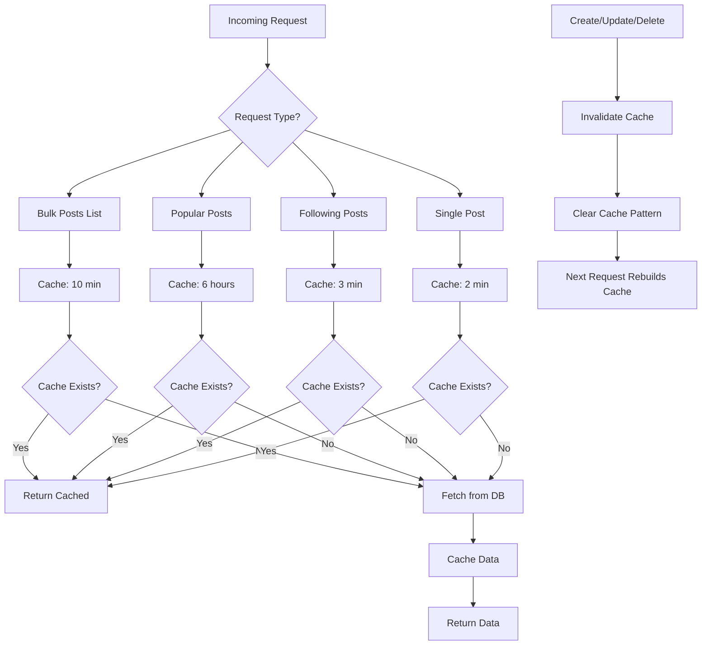
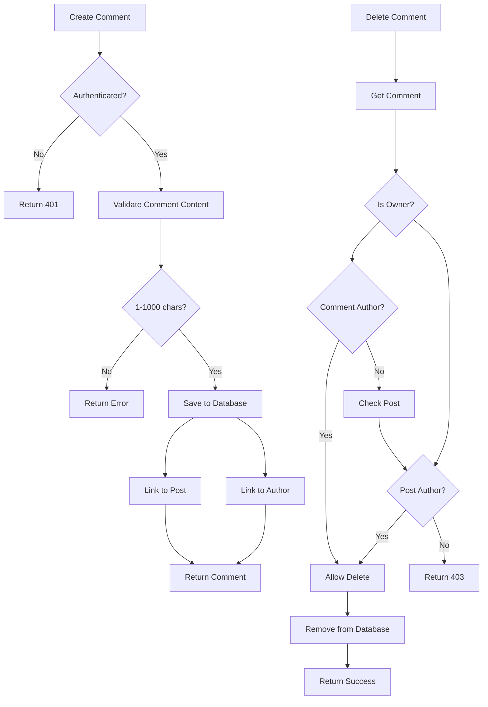
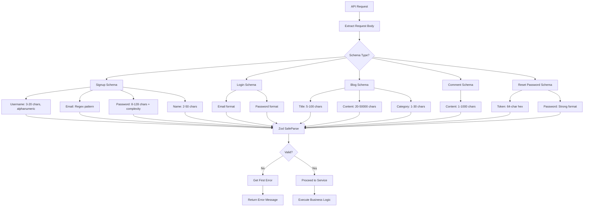

# Bloguer - System Architecture Overview

## High-Level System Architecture

## Detailed Component Flow

### 1. Authentication & User Management Flow

### 2. Password Reset Flow

### 3. Blog Post Management Flow

### 4. Analytics & Tracking System

### 5. AI Content Assistance Flow

### 6. Caching Strategy

### 7. Comment System Flow

### 8. Data Validation Flow

## Technology Stack

### Frontend

- **Framework**: React 18 with TypeScript
- **Routing**: React Router v6
- **State Management**: Zustand (Auth Store)
- **Styling**: Tailwind CSS
- **Build Tool**: Vite
- **HTTP Client**: Axios
- **Notifications**: React Hot Toast
- **Deployment**: Vercel

### Backend

- **Runtime**: Node.js with TypeScript
- **Framework**: Express.js
- **ORM**: Prisma
- **Database**: PostgreSQL
- **Validation**: Zod (via @pulkitgarg04/bloguer-validations)
- **Authentication**: JWT + Passport.js (Google OAuth)
- **Password Hashing**: Bcrypt
- **Email**: Nodemailer with Gmail SMTP
- **Caching**: Redis
- **AI Integration**: Google Gemini AI
- **Geolocation**: IP-to-Country lookup

### DevOps & Infrastructure

- **Containerization**: Docker
- **Version Control**: Git/GitHub
- **Development**: ts-node-dev (hot reload)
- **Environment**: dotenv

## Key Features

1. **Email Verification System**
   - 24-hour token expiry
   - Resend verification option
   - Auto-verified for Google OAuth users

2. **Password Reset**
   - 1-hour token expiry
   - Secure token generation (crypto.randomBytes)
   - Email-based reset flow

3. **Blog Management**
   - Create, read, update, delete posts
   - Auto-generated read time calculation
   - Category-based organization
   - Featured images per category

4. **Analytics Dashboard**
   - Real-time view tracking
   - Geographic distribution
   - Device type breakdown
   - Traffic source classification
   - Engagement metrics
   - 30-day trend analysis

5. **Social Features**
   - Follow/unfollow authors
   - Bookmark posts
   - Comment on posts
   - View following feed

6. **Performance Optimization**
   - Multi-layer caching with Redis
   - Cache invalidation on mutations
   - Efficient database queries with Prisma
   - Visitor ID tracking for unique views

7. **Security**
   - JWT-based authentication
   - Bcrypt password hashing (12 rounds)
   - Input validation at all layers
   - Rate limiting ready
   - Email verification enforcement

8. **AI Assistance**
   - Google Gemini integration
   - Content generation help
   - Writing suggestions
